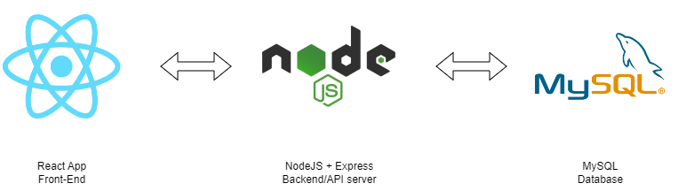
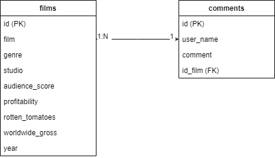

# Code challenge: Movies

## Table of Contents
- [Descrition](#Descrition)
- [Architecture](#architecture)
- [API](#API)
- [Run](#Run)

## Descrition

This app makes a list of a defined list of movies and display on the left panel of the screen, when you click on an item the right panel shows the a detailed information of the film and loads the comments; in addition, you can enter your user name and a comment and when you click on Save button, it will be posted.

The following technologies were used for the project:
- `MySQL` as the main database, with a 1:N relation between films table and comments table.
- `NodeJS + Express` as the server service and the API framework respectably (more details below).
- `React` as the Front-End framework, with custom Context to be used by most of the app components, and a Reducer that will manage the general app state.
- `Docker-composed` as the container.

## Architecture

### Overview


### Dadabase


## API

The following table shows overview of the Rest API used for this project:

| Methods | Url | Actions |
|---------|---|---|
| GET | / | get index file |
| GET | /movies | get fimls list |
| GET | /details/:id | get fiml details |
| GET | /comments/:id | get fiml comments |
| POST | /comments/:id | create new comment |

## RUN

In order to run the project please use the following command

```bash
$ docker-compose --env-file .env.prod up
```